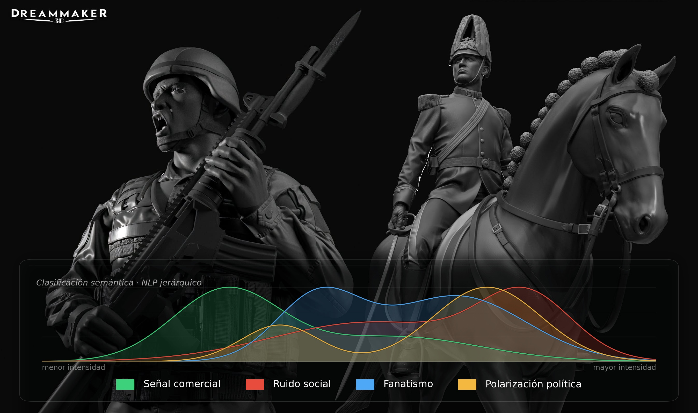

# DreamMaker Signal Analysis



Pipeline de análisis de lenguaje natural sobre comentarios de Facebook para **DreamMaker**, e-commerce chileno de figuras coleccionables de instituciones y personajes históricos nacionales.

El sistema extrae comentarios en español chileno desde la Facebook Graph API, los vectoriza con BETO (BERT en español), y los clasifica mediante un **clasificador jerárquico en dos capas** que detecta intenciones comerciales y sarcasmo condicionado. El resultado final es un dataset analítico a nivel publicación, enriquecido con métricas agregadas y variables temáticas, listo para consumo en herramientas de visualización como Power BI.

> **Versionado:** esta rama (`feature/gcp-bigquery`) migra el almacenamiento del pipeline desde archivos locales a **Google Cloud**: Bronze pasa a vivir en Cloud Storage (CSV) y Silver/Gold pasan a BigQuery, manteniendo intacta la arquitectura Medallion y el clasificador jerárquico descritos en este README. Se construye sobre [`feature/airflow-orchestration`](../../tree/feature/airflow-orchestration) (que añadió la orquestación con Apache Airflow), y ambas ramas conservan el mismo doble modo de ejecución local/Airflow. La versión puramente local, sin GCP, se mantiene en [`feature/airflow-orchestration`](../../tree/feature/airflow-orchestration). El clasificador multiclase de una sola etapa se conserva en [`legacy/v1`](../../tree/legacy/v1). En esta rama el pipeline **sigue corriendo en tu máquina** (`python pipeline.py` o Airflow standalone local) — lo único que cambia es dónde persisten los datos; la dockerización y el despliegue en una VM de GCP quedan para una rama futura. Ver [Almacenamiento en Google Cloud](#almacenamiento-en-google-cloud) para el detalle de esta migración.
=======
> **Versionado:** esta rama (`main`) contiene la arquitectura jerárquica multilabel descrita en este README, que corresponde a la versión estable del proyecto. La versión inicial del clasificador (modelo multiclase de una sola etapa) se conserva en la rama [`legacy/v1`](../../tree/legacy/v1) como referencia histórica. Ver la sección [Evolución del clasificador: de v1 a la arquitectura jerárquica](#evolución-del-clasificador-de-v1-a-la-arquitectura-jerárquica) para el detalle de esta migración.

> La rama [`feature/airflow-orchestration`](../../tree/feature/airflow-orchestration) contiene la evolución del proyecto hacia una arquitectura MLOps, incorporando Apache Airflow para la orquestación del pipeline mediante DAGs, ejecución modular de tareas y compatibilidad entre ejecución local (`pipeline.py`) y ejecución orquestada.

---

## El problema

Las publicaciones de DreamMaker generan un alto volumen de interacción donde los comentarios no siempre reflejan intención real de compra. Gran parte del contenido está influenciado por factores externos: emociones intensas, polarización ideológica, ironía y sarcasmo, introduciendo una fuerte distorsión en la lectura del valor comercial de dichas interacciones.

El problema no se limita a un análisis de sentimiento tradicional. Se trata de un problema de **interpretación semántica estructurada**, donde un mismo comentario puede contener simultáneamente intención de compra, evaluación del producto, carga emocional y distorsión sarcástica.

En particular, el sistema debe diferenciar entre:

- Intención real de compra o interés comercial
- Elogios o críticas directas hacia el producto
- Solicitudes explícitas de diseño, personalización o información
- Comentarios irrelevantes o ruido conversacional
- Expresiones emocionales o ideológicas sin asociación comercial
- **Sarcasmo como mecanismo de inversión semántica del significado literal**

El sarcasmo es especialmente crítico: puede alterar completamente la interpretación de otras etiquetas, convirtiendo un elogio aparente en una crítica real, o una solicitud en ruido ideológico. Por ello, su detección no puede tratarse como una tarea aislada.

---

## Objetivo

Desarrollar un sistema de clasificación basado en embeddings semánticos que identifique múltiples dimensiones del contenido de los comentarios y transforme dichas predicciones en una **señal de valor comercial real**.

El objetivo final no es clasificar comentarios individuales, sino construir un **dataset analítico a nivel de publicación** donde cada post queda caracterizado mediante métricas agregadas, proporciones suavizadas y variables temáticas que permiten análisis exploratorio, segmentación y extracción de conocimiento comercial.

Este dataset es la entrada principal del análisis en `02_commercial_signal_analysis.ipynb`.

---

## Qué cambia en esta rama respecto a `feature/airflow-orchestration`

| Aspecto | `feature/airflow-orchestration` | `feature/gcp-bigquery` (esta rama) |
|---|---|---|
| Bronze | CSV local (`data/bronze/`) | CSV en Cloud Storage (`gs://<BUCKET_NAME>/bronze/`) |
| Silver | CSV + Parquet local (`data/silver/`) | Tablas de BigQuery, dataset `dreammaker_silver` |
| Gold | Parquet local (`data/gold/`) | Tablas de BigQuery, dataset `dreammaker_gold` |
| Modelos entrenados (`.pkl`) | Locales en `models/`, pensados para versionarse | Se descargan desde `gs://<BUCKET_NAME>/models/` en runtime; `models/` local queda solo como caché, ignorado por git |
| Autenticación | No aplicaba | Application Default Credentials (ADC), vía `credentials/*.json` + `export GOOGLE_APPLICATION_CREDENTIALS` en la shell (ver [Configuración](#configuración)) |
| Creación de infraestructura | No aplicaba | El pipeline crea las **tablas** automáticamente (idempotente); el bucket y los **datasets** de BigQuery se crean una vez, a mano |
| Dónde corre | Local (`pipeline.py` o Airflow standalone) | Igual: local — la migración a VM/Docker queda para una rama futura |

---

## Arquitectura

El pipeline implementa una arquitectura **Medallion** (Bronze → Silver → Gold) con procesamiento incremental en cada capa.

```
pipeline.py
│
├── [1] scraper_facebook.py   →  Cloud Storage   (bronze/facebook_comments_raw.csv)
├── [2] preprocessing.py      →  BigQuery        (dreammaker_silver.facebook_comments_clean)
├── [3] embedding.py          →  BigQuery        (dreammaker_silver.facebook_comments_embeddings)
├── [4] classification.py     →  BigQuery        (dreammaker_gold.facebook_comments_*)
└── [5] aggregation.py        →  BigQuery        (dreammaker_gold.facebook_post_metrics)
```

### Comportamiento incremental

En cada ejecución, el pipeline detecta automáticamente qué comentarios son nuevos comparando IDs contra la capa siguiente (Bronze en GCS, Silver/Gold en BigQuery) y procesa **únicamente el delta**. Si no hay comentarios nuevos, cada módulo lo informa y sale limpiamente sin modificar lo ya persistido.

En la primera ejecución, procesa y persiste todo desde cero sin configuración adicional (más allá de tener el bucket y los datasets ya creados — ver [Configuración](#configuración)).

La única excepción es el módulo de agregación (`aggregation.py`), que siempre recalcula sobre el **Gold completo acumulado**, no solo sobre el delta (ver detalle más abajo).

### Doble modo de ejecución: local y Airflow

Cada módulo de `src/` expone tres funciones con una responsabilidad clara:

| Función | Uso | Firma |
|---|---|---|
| `_xxx_y_persistir(df)` | Lógica de negocio real (privada, compartida) | recibe/retorna datos, escribe en GCS/BigQuery, retorna el `path` o `table_id` de salida |
| Función pública "modo local" (ej. `generar_embeddings`, `predecir_labels`) | Llamada por `pipeline.py` | recibe un `DataFrame` en memoria (el delta ya calculado por la etapa anterior), retorna `DataFrame` |
| `task_xxx(**context)` | Callable de `PythonOperator` en el DAG | sin `DataFrame` como input: lee su propia entrada desde la capa anterior (GCS o BigQuery), calcula el delta comparando IDs contra su propia capa de salida, y retorna el `path`/`table_id` generado (para XCom) |

Ambas interfaces (local y Airflow) llaman a la misma lógica interna (`_xxx_y_persistir`), así que el comportamiento —incluyendo el procesamiento incremental— es idéntico sin importar cómo se ejecute el pipeline.

> **¿Por qué las tasks de Airflow no reciben ni retornan DataFrames vía XCom?** XCom no está pensado para transportar objetos grandes como un `DataFrame` de miles de embeddings de 768 dimensiones. En su lugar, cada task lee y escribe directamente en la capa Bronze (GCS) o Silver/Gold (BigQuery) correspondiente, y solo pasa el `path` del blob o el `table_id` resultante por XCom. Esto además hace que cada task sea atómica, idempotente y reintentable de forma independiente: si una task falla y Airflow la reintenta, simplemente vuelve a leer el estado actual de GCS/BigQuery y recalcula su propio delta.

---

## Almacenamiento en Google Cloud

| Capa | Servicio | Ubicación |
|---|---|---|
| Bronze | Cloud Storage | `gs://<BUCKET_NAME>/bronze/facebook_comments_raw.csv` |
| Silver | BigQuery | dataset `dreammaker_silver` |
| Gold | BigQuery | dataset `dreammaker_gold` |
| Modelos entrenados | Cloud Storage | `gs://<BUCKET_NAME>/models/` |
| Reportes / análisis exploratorio | Cloud Storage | `gs://<BUCKET_NAME>/reports/` |

**Por qué Bronze en GCS y no en BigQuery:** Bronze es el dato crudo, sin tipar ni transformar, tal como llega de la API — un caso de uso natural de *object storage* más que de un warehouse consultable. Silver y Gold sí necesitan agregarse, filtrarse y consultarse (ej. desde Power BI), por lo que viven en BigQuery.

**Cómo funciona el incremental contra cada servicio:**
- **GCS** no soporta append nativo a un blob existente (los objetos son inmutables). El patrón usado (`src/gcp_io.py::escribir_csv_gcs`) es: descargar el CSV existente, concatenar en memoria con el delta nuevo, y volver a subir el archivo completo.
- **BigQuery** sí soporta append del lado del servidor: cada módulo consulta `SELECT DISTINCT <id>` para saber qué ya existe, y hace un *load job* en modo `WRITE_APPEND` con el delta — sin traer la tabla completa a memoria. La única excepción es `facebook_post_metrics`, que se recalcula entero cada corrida y se sube en modo `WRITE_TRUNCATE` (reemplaza la tabla completa), porque el prior bayesiano depende de todos los datos, no de un delta.

**Creación de infraestructura — qué automatiza el código y qué no:** El pipeline crea automáticamente las **tablas** de BigQuery si no existen (con schema explícito, ver `src/schemas.py`), pero **no crea los datasets** (`dreammaker_silver`, `dreammaker_gold`) ni el **bucket**. Esos se crean una única vez, a mano (o vía IaC en el futuro) — ver los comandos en [Configuración](#configuración). Es una decisión deliberada: crear datasets/buckets es una operación de infraestructura poco frecuente que conviene hacer explícita, en vez de que quede escondida dentro de la primera corrida del pipeline.

**Embeddings en BigQuery:** los vectores de 768 dimensiones (`embedding`, `post_embedding`) se guardan como columnas `FLOAT64` en modo `REPEATED` — el equivalente de BigQuery a un array de floats por fila. Al leerlos de vuelta con la librería cliente, cada celda vuelve como una lista/array de Python, que se re-normaliza con `np.array(...)` antes de alimentar los modelos.

**Modelos entrenados:** los `.pkl` (`logistic_ovr_model.pkl`, `logistic_ovr_thresholds.pkl`, `xgb_sarcasm_model.pkl`, `xgb_sarcasm_threshold.pkl`) **ya no se versionan en git**. Se suben a mano a `gs://<BUCKET_NAME>/models/` una vez entrenados, y `classification.py` los descarga a `./models/` (carpeta local ignorada por git, usada como caché) la primera vez que se necesitan — en corridas siguientes, si ya están en disco, no se vuelven a descargar.

---

## Etapas del pipeline

### 1. Scraping — Bronze (Cloud Storage)

Extrae posts y comentarios desde la **Facebook Graph API v18.0** con paginación segura.

- Deduplicación de posts y comentarios por ID en memoria
- Control de loops de paginación mediante set de URLs visitadas
- Descarte temprano de comentarios sin texto (stickers, GIFs, imágenes) antes de persistir
- Detección incremental: carga los `comment_id` existentes en el CSV de Bronze en GCS y solo sube (y retorna) el delta

**Salida:** `gs://<BUCKET_NAME>/bronze/facebook_comments_raw.csv`

### 2. Preprocesamiento — Silver (BigQuery)

Limpieza de texto y tipado sobre el delta recibido desde Bronze.

- Filtrado de filas con `comment_message` vacío (segunda línea de defensa)
- Normalización: lowercase, eliminación de tildes (NFD), colapso de saltos de línea y espacios múltiples, colapso de signos repetidos
- Genera `clean_comment_message` y `clean_post_message`
- Castea `post_created`/`comment_created` a `TIMESTAMP` y los contadores de reacciones a `INTEGER`, para que calcen con el schema de BigQuery
- Append incremental (`WRITE_APPEND`) a la tabla Silver

**Salida:** tabla `dreammaker_silver.facebook_comments_clean`

### 3. Embeddings — Silver (BigQuery)

Vectorización con **BETO** (`dccuchile/bert-base-spanish-wwm-cased`), modelo BERT preentrenado en español.

- Mean pooling sobre la última capa oculta → vector de 768 dimensiones
- Genera `embedding` (comentario) y `post_embedding` (publicación), guardados como `FLOAT64 REPEATED`
- Procesamiento por lotes configurable (`batch_size=32`)
- El modelo se carga una sola vez al importar el módulo
- Append incremental a la tabla Silver

**Salida:** tabla `dreammaker_silver.facebook_comments_embeddings`

### 4. Clasificación jerárquica — Gold (BigQuery)

El problema de clasificación se aborda mediante una **arquitectura jerárquica de dos capas**, diseñada para desacoplar la interpretación semántica general de la detección específica de sarcasmo.

Inicialmente se evaluó un único modelo multilabel; sin embargo, se observó que el sarcasmo es un fenómeno altamente dependiente del contexto de intención, dificultando su detección cuando se analiza únicamente el texto. Por este motivo se implementó la arquitectura jerárquica: las predicciones de intención de Capa 1 actúan como contexto explícito para el detector de sarcasmo en Capa 2.

> Esta arquitectura de dos capas es, a su vez, la segunda generación del clasificador del proyecto. La primera versión (rama `legacy/v1`) usaba un único modelo multiclase de etiqueta única — ver [Evolución del clasificador](#evolución-del-clasificador-de-v1-a-la-arquitectura-jerárquica) para el detalle completo de ese cambio.

#### Capa 1 — Clasificación multilabel de intenciones

Modelo de **Regresión Logística One-vs-Rest** entrenado sobre embeddings BETO de 768 dimensiones.

Predice 8 etiquetas no mutuamente excluyentes que representan la interpretación semántica base del comentario:

| Etiqueta | Descripción |
|---|---|
| `interes` | Interés comercial en el producto |
| `elogio_producto` | Elogio o valoración positiva del producto |
| `critica_producto` | Crítica o reclamo sobre el producto |
| `fanatismo_emocional` | Comentario emocional o fanático sin intención comercial |
| `conflictivo` | Contenido político o polarizante |
| `solicitud` | Solicitud de información, precio o disponibilidad |
| `cuidado` | Expresión de afecto o cuidado |
| `otro` | Sin categoría identificable |

Cada etiqueta tiene un **threshold optimizado individualmente** para maximizar F1 en clases desbalanceadas.

#### Capa 2 — Detección de sarcasmo condicionado

Modelo **XGBoost** que recibe como input la **concatenación** del embedding del comentario (768-dim) con las predicciones binarias de Capa 1 (8-dim), totalizando un vector de 776 dimensiones.

Desde el punto de vista del aprendizaje automático, el sarcasmo deja de ser una tarea aislada para convertirse en una **clasificación contextualizada**: el modelo dispone de información explícita sobre la intención aparente del comentario, lo que le permite distinguir con mayor precisión entre expresiones literales e irónicas.

#### Modelos entrenados

Los 4 artefactos (`logistic_ovr_model.pkl`, `logistic_ovr_thresholds.pkl`, `xgb_sarcasm_model.pkl`, `xgb_sarcasm_threshold.pkl`) se descargan automáticamente desde `gs://<BUCKET_NAME>/models/` a `./models/` la primera vez que `classification.py` los necesita — ver [Almacenamiento en Google Cloud](#almacenamiento-en-google-cloud).

#### Reglas de negocio

Las predicciones de ambas capas se combinan mediante reglas lógicas para construir etiquetas orientadas al análisis comercial:

| Variable | Lógica |
|---|---|
| `interes_real` | `interes=1` AND `sarcasmo=0` |
| `solicitud_real` | `solicitud=1` AND `sarcasmo=0` |
| `elogio_real` | `elogio_producto=1` AND `sarcasmo=0` |
| `critica_genuina` | `critica_producto=1` AND `sarcasmo=0` AND `conflictivo=0` |
| `polarizacion_politica` | `conflictivo=1` |
| `fanatismo` | `fanatismo_emocional=1` AND `sarcasmo=0` |
| `fanatismo_no_comercial` | `fanatismo_emocional=1` AND `sarcasmo=0` AND `interes=0` |

**Salidas (tablas BigQuery, dataset `dreammaker_gold`):**
- `facebook_comments_classified` — predicciones binarias
- `facebook_comments_probabilities` — probabilidades por etiqueta
- `facebook_comments_gold_enriched` — columnas originales + predicciones + reglas de negocio

### 5. Agregación — Gold (BigQuery)

Una vez clasificadas todas las interacciones individuales, el pipeline cambia la unidad de análisis desde el comentario hacia la **publicación**. Esta transformación constituye uno de los principales aportes del pipeline.

#### Construcción de señales compuestas

Las etiquetas derivadas por las reglas de negocio no son mutuamente excluyentes: un mismo comentario puede manifestar interés comercial, realizar una solicitud y además elogiar el producto. Si se sumaran todas las categorías directamente, un mismo comentario sería contabilizado múltiples veces.

Para evitar este sesgo se construyen primero dos **señales compuestas binarias** mediante operadores lógicos OR, de modo que cada comentario aporte como máximo una unidad:

- **`comentario_senal_comercial`**: `interes_real` OR `solicitud_real` OR `elogio_real` OR `critica_genuina`
- **`comentario_ruido_social`**: `polarizacion_politica` OR `fanatismo_no_comercial`

#### Métricas por publicación con suavizado bayesiano

Las publicaciones presentan volúmenes de comentarios muy dispares. Utilizar proporciones clásicas produce estimaciones inestables cuando una publicación tiene poca evidencia.

Para reducir este problema se aplica **Bayesian Smoothing** con un prior estimado a partir del comportamiento global del dataset:

```
prop = (volumen_label + α × p_global) / (volumen_total + α)
```

donde `α = mediana del volumen de comentarios por publicación` (prior adaptativo) y `p_global` es la proporción global de cada etiqueta. Esto reduce la variabilidad en publicaciones con pocos comentarios sin modificar sustancialmente aquellas con abundante evidencia.

Se calculan volúmenes y proporciones suavizadas para: interés, solicitudes, elogios, críticas, polarización, fanatismo, fanatismo no comercial, señal comercial y ruido social.

Este módulo siempre lee el **Gold classified completo** desde BigQuery (no solo el delta) para que el prior sea consistente con todos los datos disponibles, y re-aplica las reglas de negocio de `classification.py` en cada ejecución para reflejar siempre la versión actual de las reglas. El resultado reemplaza la tabla de métricas completa (`WRITE_TRUNCATE`) en cada corrida.

#### Clasificación temática de publicaciones

Variables binarias inferidas por regex sobre el texto de la publicación (no mutuamente excluyentes):

| Variable | Detecta |
|---|---|
| `post_producto_materializado` | Menciones a características físicas del producto (cm, escala, material, etc.) |
| `post_carabineros` | Carabineros de Chile |
| `post_ejercito` | Ejército de Chile |
| `post_fach` | Fuerza Aérea de Chile |
| `post_armada` | Armada / Infantería de Marina |
| `post_pdi` | Policía de Investigaciones |
| `post_guerra_pacifico` | Guerra del Pacífico |
| `post_personajes_historicos` | Personajes históricos chilenos (Allende, Pinochet, O'Higgins, Prat, etc.) |

**Salida:** tabla `dreammaker_gold.facebook_post_metrics`

---

## Estructura del repositorio

```
dreammaker-signal-analysis/
│
├── src/
│   ├── __init__.py
│   ├── config.py                 # Configuración central: proyecto GCP, bucket, datasets, tablas
│   ├── schemas.py                 # Schemas explícitos de BigQuery (tablas Silver y Gold)
│   ├── gcp_io.py                  # Helpers de I/O compartidos contra Cloud Storage y BigQuery
│   ├── scraper_facebook.py        # Extracción desde Facebook Graph API → Bronze (GCS)
│   ├── preprocessing.py           # Limpieza de texto → Silver (BigQuery)
│   ├── embedding.py               # Vectorización con BETO → Silver (BigQuery)
│   ├── classification.py          # Clasificador jerárquico + reglas de negocio → Gold (BigQuery)
│   └── aggregation.py             # Métricas por publicación + suavizado bayesiano → Gold (BigQuery)
│
├── dags/
│   └── dreammaker_dag.py         # DAG de Airflow: encadena las 5 etapas como PythonOperators
│
├── docs/
│   └── images/
│       └── dreammaker_banner.jpg # Banner del proyecto usado en este README
│
├── reports/
│   └── DreamMaker_Commercial_Analysis_Report.pdf
│
├── models/                       # Caché local de modelos descargados desde GCS (no incluida en el repo)
├── data/                         # Legado de exploración local en notebooks (no incluida en el repo)
├── labeling/                     # Dataset de entrenamiento (no incluida en el repo)
├── outputs/                      # Resultados y exportaciones del análisis (no incluida en el repo)
├── credentials/                  # JSON de la cuenta de servicio de GCP (no incluida en el repo)
├── airflow/                      # AIRFLOW_HOME local: airflow.cfg, metadata db, logs (no incluida en el repo)
├── .venv_airflow/                # Entorno virtual dedicado a Airflow (no incluida en el repo)
│
├── pipeline.py                   # Orquestador principal — modo local
├── start_airflow.sh              # Levanta Airflow standalone apuntando a este proyecto (no incluida en el repo)
├── README.md
├── requirements.txt
├── .gitignore
├── my_env.env                    # Variables de entorno (no incluida en el repo)
├── 01_semantic_classification_pipeline.ipynb
└── 02_commercial_signal_analysis.ipynb
```

> **Nota:** `data/`, `labeling/`, `outputs/`, `credentials/`, `airflow/`, `.venv_airflow/`, `models/`, `my_env.env` y `start_airflow.sh` no se incluyen en el repositorio (ver `.gitignore`). `credentials/` guarda el JSON de la cuenta de servicio usada para autenticarse localmente contra GCP — nunca se versiona, por razones obvias de seguridad. `models/` ahora es solo una caché local: se puebla automáticamente al correr el pipeline, descargando los artefactos desde `gs://<BUCKET_NAME>/models/` (antes, en `feature/airflow-orchestration`, se pensaba para versionarse en git). `labeling/` contiene muestras reales de comentarios y publicaciones de la PYME utilizadas para entrenar los modelos de Capa 1 y Capa 2, por lo que se omite por confidencialidad de los datos del cliente. El notebook `01_semantic_classification_pipeline.ipynb` documenta la metodología de entrenamiento (features, arquitectura, thresholds, evaluación), pero no es 100% reproducible de punta a punta sin ese dataset.

---

## Instalación

```bash
git clone https://github.com/Claudio-Val/dreammaker-signal-analysis.git
cd dreammaker-signal-analysis
git checkout feature/gcp-bigquery
pip install -r requirements.txt
```

Requiere **Python 3.12**.

---

## Configuración

### Credenciales de Facebook

Crea el archivo `my_env.env` en la raíz del proyecto con:

```env
FACEBOOK_TOKEN=your_facebook_page_access_token_here
PAGE_ID=your_facebook_page_id_here
```

| Variable | Descripción | Dónde obtenerla |
|---|---|---|
| `FACEBOOK_TOKEN` | Token de acceso de página con permisos `pages_read_engagement` y `pages_read_user_content` | [Meta for Developers → Graph API Explorer](https://developers.facebook.com/tools/explorer/) |
| `PAGE_ID` | ID numérico de la página de Facebook a analizar | URL de la página o desde el Graph API Explorer |

> **Importante:** El token de acceso de página tiene una duración limitada. Para uso en producción se recomienda generar un token de larga duración desde la documentación oficial de Meta.

### Configuración de Google Cloud

Todos los identificadores de proyecto/bucket/datasets/tablas viven centralizados en `src/config.py`:

| Constante | Valor por defecto | Descripción |
|---|---|---|
| `PROJECT_ID` | `learned-surge-481419-p1` | Proyecto de GCP (override: env var `GCP_PROJECT_ID`) |
| `BQ_LOCATION` | `US` | Región de los datasets de BigQuery (override: `BQ_LOCATION`) |
| `BUCKET_NAME` | `dreammaker-mlops` | Bucket de Cloud Storage (override: `GCS_BUCKET_NAME`) |
| `DATASET_BRONZE` | `bronze` | Prefijo/carpeta de Bronze dentro del bucket (no es un dataset de BigQuery) |
| `DATASET_SILVER` | `dreammaker_silver` | Dataset de BigQuery para Silver |
| `DATASET_GOLD` | `dreammaker_gold` | Dataset de BigQuery para Gold |
| `MODELS_PATH` | `models` | Prefijo de los modelos entrenados dentro del bucket |
| `REPORTS_PATH` | `reports` | Prefijo de reportes/exploración dentro del bucket |

Si tu proyecto, bucket o región difieren de los valores por defecto, agrégalos a `my_env.env` (por ejemplo `GCP_PROJECT_ID=otro-proyecto`) en vez de editar `config.py`.

**Prerrequisitos de infraestructura — se crean una sola vez, a mano** (el pipeline crea las tablas automáticamente, pero no el bucket ni los datasets — ver [Almacenamiento en Google Cloud](#almacenamiento-en-google-cloud)):

```bash
# Bucket de Cloud Storage
gsutil mb -l US gs://dreammaker-mlops

# Datasets de BigQuery
bq mk --dataset --location=US learned-surge-481419-p1:dreammaker_silver
bq mk --dataset --location=US learned-surge-481419-p1:dreammaker_gold

# Subir los modelos ya entrenados (ver 01_semantic_classification_pipeline.ipynb)
gsutil cp models/*.pkl gs://dreammaker-mlops/models/
```

**Autenticación (Application Default Credentials):**

En esta rama el pipeline corre en tu máquina, así que la autenticación se resuelve con el JSON de una cuenta de servicio guardado localmente:

```bash
mkdir -p credentials
# copia tu JSON de cuenta de servicio a credentials/gcp-service-account.json
export GOOGLE_APPLICATION_CREDENTIALS=$PWD/credentials/gcp-service-account.json
python pipeline.py
```

Puntos importantes:
- `credentials/` está en `.gitignore` — el JSON nunca se versiona.
- La ruta **no** se guarda en `my_env.env` ni en ningún otro archivo del proyecto: el `export` se hace a mano en cada sesión de terminal antes de correr el pipeline (o se agrega al `.bashrc`/`.zshrc` local de cada quien, fuera del repo).
- Ningún módulo de `src/` recibe esta ruta como parámetro ni la referencia directamente — `google-cloud-storage` y `google-cloud-bigquery` la resuelven solos vía ADC. Esto es intencional: cuando este proyecto se despliegue en una VM de GCP (rama futura), simplemente no se exporta esta variable ahí, y las mismas librerías caen automáticamente a la cuenta de servicio adjunta a la VM, sin tocar una línea de código.
- La cuenta de servicio necesita, como mínimo, `roles/bigquery.dataEditor` + `roles/bigquery.jobUser` sobre el proyecto, y `roles/storage.objectAdmin` sobre el bucket.

---

## Orquestación con Airflow

Esta rama conserva el **DAG de Apache Airflow** (`dags/dreammaker_dag.py`) heredado de `feature/airflow-orchestration`, que orquesta las mismas 5 etapas como tasks independientes — ahora leyendo y escribiendo contra GCS/BigQuery en vez de disco local.

```
dreammaker_comments_pipeline (dag_id)

scraping_bronze  →  preprocessing_silver_csv  →  embeddings_silver_parquet  →  clasificacion_gold  →  agregacion_gold_post_metrics
```

| Task | Callable | Lee | Escribe |
|---|---|---|---|
| `scraping_bronze` | `task_scraping` | Facebook Graph API | `gs://<BUCKET_NAME>/bronze/facebook_comments_raw.csv` |
| `preprocessing_silver_csv` | `task_preprocessing` | Bronze (GCS) | `dreammaker_silver.facebook_comments_clean` |
| `embeddings_silver_parquet` | `task_embeddings` | Silver clean (BigQuery) | `dreammaker_silver.facebook_comments_embeddings` |
| `clasificacion_gold` | `task_clasificacion` | Silver embeddings (BigQuery) | `dreammaker_gold.facebook_comments_*` |
| `agregacion_gold_post_metrics` | `task_agregacion` | Gold classified completo (BigQuery) | `dreammaker_gold.facebook_post_metrics` |

Configuración del DAG sin cambios respecto a la rama anterior: `schedule = "0 6 * * *"`, `catchup=False`, `max_active_runs=1`, `retries=2` con `retry_delay=5min` por task, y `execution_timeout` de 2 horas en la task de embeddings.

La configuración de entorno (`.venv_airflow/`, `start_airflow.sh`, `dags_folder`, Airflow Variables para `FACEBOOK_TOKEN`/`PAGE_ID`) es la misma que en `feature/airflow-orchestration` — no repetida acá para evitar duplicación; ver esa rama para el detalle paso a paso.

**Credenciales de GCP en modo Airflow (en esta rama):** como `start_airflow.sh` se ejecuta en la misma sesión de terminal donde exportaste `GOOGLE_APPLICATION_CREDENTIALS`, el proceso de Airflow hereda esa variable y se autentica igual que el modo local — no requiere configuración adicional por ahora. Esto es una particularidad de correr Airflow *standalone* en tu propia máquina; cuando el pipeline se despliegue en una VM (rama futura), este mecanismo cambiará por la cuenta de servicio adjunta a la instancia.

---

## Uso

```bash
export GOOGLE_APPLICATION_CREDENTIALS=$PWD/credentials/gcp-service-account.json
python pipeline.py
```

El pipeline detecta automáticamente si es la primera ejecución o si hay comentarios nuevos desde la última vez que se corrió.

**Salida esperada:**

```
[1/5] Extrayendo comentarios nuevos desde Facebook...
  Bronze existente en GCS: 2961 comment_id registrados.
  Posts extraídos desde la API: 197
  Comentarios únicos extraídos desde la API: 2985
  ─────────────────────────────────────────────
  24 comentarios nuevos subidos a Bronze (GCS).
  Total Bronze acumulado: 2985 registros.
  gs://dreammaker-mlops/bronze/facebook_comments_raw.csv
  ─────────────────────────────────────────────

[2/5] Preprocesando comentarios nuevos...
[3/5] Generando embeddings BETO...
[4/5] Clasificando comentarios nuevos (pipeline jerárquico)...
[5/5] Calculando métricas por publicación...

✅ Pipeline incremental finalizado.
   Comentarios nuevos procesados : 24
   Publicaciones con métricas    : 197
```

---

## Dependencias principales

| Librería | Uso |
|---|---|
| `transformers` | Modelo BETO para embeddings |
| `torch` | Backend de inferencia |
| `scikit-learn` | Regresión Logística OvR, métricas |
| `xgboost` | Clasificador de sarcasmo |
| `pandas` | Manipulación de datos |
| `requests` | Llamadas a la Facebook Graph API |
| `python-dotenv` | Carga de variables de entorno |
| `joblib` | Serialización de modelos |
| `tqdm` | Barras de progreso en generación de embeddings |
| `google-cloud-storage` | Lectura/escritura de Bronze y descarga de modelos desde GCS |
| `google-cloud-bigquery` | Lectura/escritura de Silver y Gold en BigQuery |
| `pyarrow` | Requerido por `google-cloud-bigquery` para cargar DataFrames vía `load_table_from_dataframe` |
| `apache-airflow` | Orquestación del pipeline (schedule, reintentos, monitoreo) — instalado en `.venv_airflow/`, entorno separado |

---

## Outputs finales

| Ubicación | Nivel | Descripción |
|---|---|---|
| `gs://<BUCKET_NAME>/bronze/facebook_comments_raw.csv` | Comentario | Datos crudos de la API |
| `dreammaker_silver.facebook_comments_clean` | Comentario | Texto limpio, normalizado y tipado |
| `dreammaker_silver.facebook_comments_embeddings` | Comentario | Embeddings BETO (768-dim, `FLOAT64 REPEATED`) |
| `dreammaker_gold.facebook_comments_classified` | Comentario | Predicciones binarias |
| `dreammaker_gold.facebook_comments_probabilities` | Comentario | Probabilidades por etiqueta |
| `dreammaker_gold.facebook_comments_gold_enriched` | Comentario | Predicciones + reglas de negocio |
| `dreammaker_gold.facebook_post_metrics` | **Publicación** | Métricas agregadas + suavizado bayesiano + clasificación temática |

---

## Resultados e insights comerciales

El análisis comercial completo y los principales hallazgos están disponibles en:

📄 [Informe de análisis comercial de DreamMaker](reports/DreamMaker_Commercial_Analysis_Report.pdf)

El informe cubre:

- Análisis exploratorio de señales comerciales vs. sociales
- Contraste de hipótesis estadísticas
- Regresión binomial negativa
- Análisis de árboles de decisión sobre regímenes de comportamiento viral
- Insights de negocio derivados de 9 años de interacciones en Facebook

---

## Evolución del clasificador: de v1 a la arquitectura jerárquica

La versión inicial del proyecto (conservada en la rama [`legacy/v1`](../../tree/legacy/v1)) usaba un enfoque distinto y considerablemente más simple, tanto en el problema de clasificación como en la infraestructura:

- **Un único modelo**, entrenado como **clasificación multiclase de etiqueta única** (`model.predict(X)` retorna una sola clase por comentario), no multilabel.
- **5 clases mutuamente excluyentes**: `Crítica genuina`, `Comentario político emocional`, `Elogio al producto`, `Pregunta sobre el producto`, `Otro`.
- Desplegado sobre Databricks, cargando el modelo desde `dbfs:/FileStore/dreammaker/models/modelo_reg.pkl`, sin la arquitectura Bronze/Silver/Gold incremental ni el pipeline modular de la versión actual.

**El problema que motivó el cambio:** el supuesto de exclusividad mutua no se sostenía en los datos reales. Un mismo comentario puede, al mismo tiempo, expresar interés comercial *y* ser políticamente cargado ("me encantaría comprarlo pero apoyar esto es una vergüenza"), o combinar una solicitud de información con fanatismo emocional sin intención de compra. Forzar una sola etiqueta por comentario obligaba al modelo a elegir una de esas dimensiones y descartar la otra, perdiendo información comercial válida en exactamente los casos más ambiguos y polarizados — que en este catálogo son frecuentes, no marginales.

**La solución:** migrar a la arquitectura jerárquica multilabel descrita en la sección [Clasificación jerárquica](#4-clasificación-jerárquica--gold-bigquery) de este README: una Capa 1 que predice 8 etiquetas no excluyentes de forma independiente, y una Capa 2 que usa esas predicciones como contexto para detectar sarcasmo — permitiendo que un comentario sea, por ejemplo, simultáneamente `interes=1` y `conflictivo=1`, en vez de forzarlo a una sola categoría.

La rama `legacy/v1` se mantiene por trazabilidad histórica del proyecto, pero no recibe mantenimiento; el desarrollo activo ocurre sobre `main` y sus ramas de feature, como `feature/airflow-orchestration` y `feature/gcp-bigquery`.

---

## Notas de diseño

**¿Por qué arquitectura jerárquica para el sarcasmo?**
Se evaluó inicialmente un único modelo multilabel que incluyera sarcasmo como una etiqueta más. Sin embargo, el sarcasmo es un fenómeno contextual que depende fuertemente de la intención aparente del mensaje: un elogio puede ser sarcástico, pero solo puede identificarse como tal si se conoce primero que el comentario pretende elogiar. Al separar en dos capas y pasar las predicciones de intención como input al detector de sarcasmo, el modelo tiene contexto explícito para identificar ese contraste.

**¿Por qué señales compuestas antes de agregar?**
Las etiquetas de negocio no son mutuamente excluyentes. Un comentario puede tener `interes_real=1`, `solicitud_real=1` y `elogio_real=1` simultáneamente. Si se sumaran directamente las tres columnas al agregar por publicación, ese comentario contaría tres veces en el volumen de señal comercial. Las señales compuestas (`comentario_senal_comercial`, `comentario_ruido_social`) garantizan que cada comentario aporte como máximo una unidad, independientemente de cuántas etiquetas active.

**¿Por qué suavizado bayesiano en las métricas por post?**
Las publicaciones tienen volúmenes de comentarios muy dispares. Sin suavizado, una publicación con 2 comentarios donde 1 es de interés tendría `prop_interes = 0.5`, lo cual es una estimación poco confiable estadísticamente. El prior adaptativo (`α = mediana del volumen`) regula esta varianza: publicaciones con pocos comentarios se acercan al promedio global, mientras que publicaciones con mucha evidencia no se ven afectadas.

**¿Por qué el módulo de agregación recalcula siempre sobre el Gold completo?**
Las proporciones globales usadas como prior bayesiano deben reflejar el estado real del dataset en cada ejecución. Si solo se recalculara sobre el delta, el prior estaría sesgado por la muestra más reciente y las métricas de todas las publicaciones cambiarían de forma incoherente entre ejecuciones.

**¿Por qué los modelos entrenados ya no se versionan en git?**
Git está pensado para versionar texto diffeable, no binarios de varios MB — cada `.pkl` subido queda para siempre en el historial, incluso si después se borra. Separar código (git) de artefactos de modelo (Cloud Storage, con versionado por carpeta si se quiere) es el patrón estándar de MLOps, y además evita que clonar el repo dependa de traer binarios pesados que no todos los que exploran el código necesitan.

---

## Autor

**Claudio Valenzuela**
- GitHub / Portafolio: [github.com/Claudio-Val](https://github.com/Claudio-Val)
- Email: claudio.valenzuela.val@gmail.com
